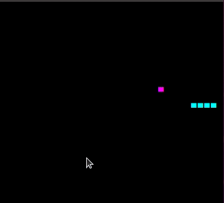

# java-snake-game

Game developed for algorithm introduction course. The core idea of the game was to dive into game development altogether with better understanding Dijkstra algorithm, and it's improved Astar version.
Snake might be improved by recalculating walls and also other improvements are possible but this is the trick how to improve it.

## Technical details
- Swing
- Java8
- Astar algorithm

## Game usage
- Keyboard arrows
- A - toggles auto mode

## How game looks like

## Contributors
- @belushkin

## Licence
MIT
